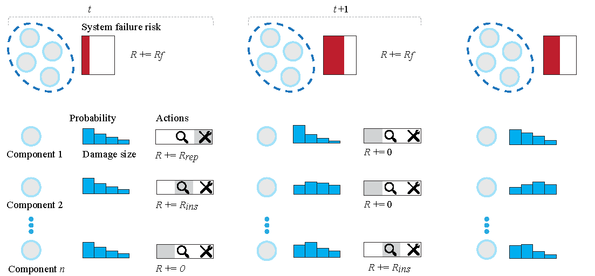

# IMP-MARL: a Suite of Environments for Large-scale Infrastructure Management Planning via MARL


**IMP-MARL** offers a platform for benchmarking the scalability of cooperative MARL methods in real-world engineering applications.

In IMP-MARL, you can:
- [Implement your own infrastructure management planning (IMP) environment or execute an available IMP environment](./imp_env/).
- [Train IMP policies through state-of-the-art MARL methods. The environments can be integrated with typical ecosystems via wrappers](imp_wrappers/).
- [Compute expert-based heuristic policies](./heuristics/)

Additionally, you will be able to:
- Retrieve the results of a benchmark campaign, where MARL methods are assessed in terms of scalability.
- Reproduce our experiments.

This repository has been developed and is maintained by Pascal Leroy & Pablo G. Morato.

Please consider opening an issue or a pull request to help us improve this repository.

Future developments are described in the [roadmap](ROADMAP.md).



## Main requirements:
To work with our environments, one only needs to install [Numpy](https://numpy.org/install/).

However, to reproduce our results, more packages are required and installation instructions are provided [here](pymarl/README.md).

## Tutorials
- [Create your own IMP environment scenario](imp_env/new_imp_env_tutorial.ipynb)
- [IMP's API explained](imp_wrappers/README.md)
- [Train agents like in the paper and/or **reproduce** the results](pymarl/README.md)
- [Retrieve the results of the paper](results_scripts/README.md)
- [Train your own MARL agents with PyMarl](pymarl/EXEC_PYMARL.md)
- [Reproduce the results of the paper](REPROD_EXP.md)

## Sets of environments available:
- [(Correlated and uncorrelated) k-out-of-n system with components subject to fatigue deterioration.](./imp_env/struct_env.py)
- [Offshore wind structural system with components subject to fatigue deterioration.](./imp_env/owf_env.py)

**Note: A campaign cost can be activated in any environment.**

## Available wrappers with examples: 
- Ready: [**PyMarl**](imp_wrappers/pymarl_wrapper): [Multi](imp_wrappers/pymarl_wrapper/pymarl_wrap_ma_struct.py) and [single](imp_wrappers/pymarl_wrapper/pymarl_wrap_sa_struct.py) agent wrappers.
- Ready: [**Gymnasium**](imp_wrappers/gymnasium/gym_wrap_sa_struct.py): Single-agent wrapper.
- Ready: [**PettingZoo**](imp_wrappers/pettingzoo/pettingzoo_wrap_struct.py) : Multi-agent wrapper.
- Ready: [**Rllib example**](imp_wrappers/examples/rllib/rllib_example.py): Single-agent training with RLLib and Gymnasium wrapper.
- Ready: [**MARLlib**](imp_wrappers/marllib/marllib_wrap_ma_struct.py): Examples include random agents and how to train with MARLlib.
- WIP: [**TorchRL example**](): TBD

## PyMarl algorithms available:

To train agents with PyMarl and one of the following algorithms, instructions are available [here](pymarl/EXEC_PYMARL.md):

- [**QMIX**: QMIX: Monotonic Value Function Factorisation for Deep Multi-Agent Reinforcement Learning](https://arxiv.org/abs/1803.11485)
- [**QVMIX**: QVMix and QVMix-Max: Extending the Deep Quality-Value Family of Algorithms to Cooperative Multi-Agent Reinforcement Learning](https://arxiv.org/abs/2012.12062)
- [**QPLEX**: QPLEX: Duplex Dueling Multi-Agent Q-Learning](https://arxiv.org/abs/2008.01062)
- [**COMA**: Counterfactual Multi-Agent Policy Gradients](https://arxiv.org/abs/1705.08926)
- [**FACMAC**: Factored Multi-Agent Centralised Policy Gradients](https://arxiv.org/abs/2003.06709)
- [**VDN**: Value-Decomposition Networks For Cooperative Multi-Agent Learning](https://arxiv.org/abs/1706.05296) 
- [**IQL**: Independent Q-Learning](https://arxiv.org/abs/1511.08779)

The main code is derived from [PyMarl original implementation](https://github.com/oxwhirl/pymarl).

## Expert-knowledge baselines available:
- [Expert-based heuristic strategies](https://www.sciencedirect.com/science/article/pii/S0167473017302138)

## Run an IMP environment 
```
env = Struct({'n_comp': 3,
               'discount_reward': 0.95,
               'k_comp': 2,
               'env_correlation': False,
               'campaign_cost': False})

obs, rewards_sum, done = env.reset(), 0, False
while not done:
    actions = {f"agent_{i}": random.randint(0,2) for i in range(3)}
    obs, rewards, done, insp_outcomes = env.step(actions) 
```   

## Citation
If you use IMP-MARL in your work, please consider citing our paper:

[IMP-MARL: a Suite of Environments for Large-scale Infrastructure Management Planning via MARL](https://arxiv.org/abs/2306.11551)
```
@inproceedings{
leroy2023impmarl,
title={{IMP}-{MARL}: a Suite of Environments for Large-scale Infrastructure Management Planning via {MARL}},
author={Pascal Leroy and Pablo G. Morato and Jonathan Pisane and Athanasios Kolios and Damien Ernst},
booktitle={Thirty-seventh Conference on Neural Information Processing Systems Datasets and Benchmarks Track},
year={2023},
url={https://openreview.net/forum?id=q3FJk2Nvkk}
}
```
